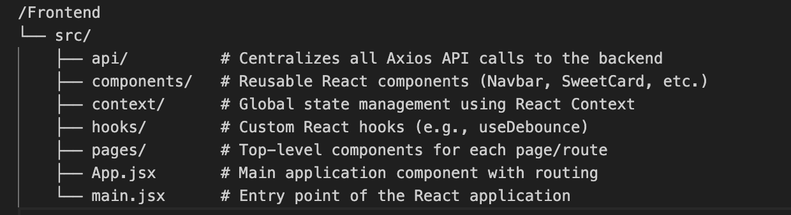
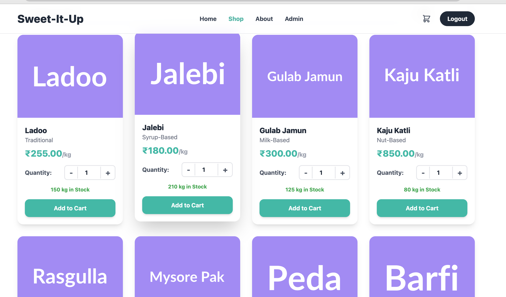
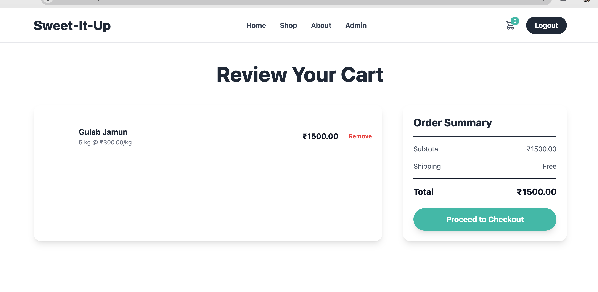
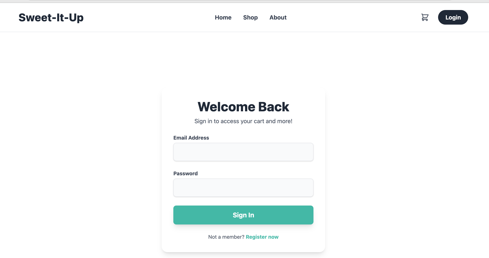
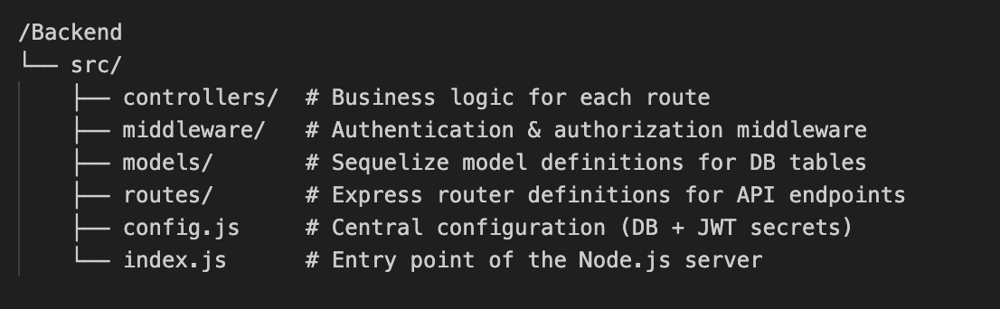

# 🍬 Sweet Shop Management System

Welcome to the **Sweet Shop Management System**, a full-stack web application designed to manage an online sweet shop. This project features a complete **backend API** for handling inventory, user authentication, and purchases, along with a **modern, responsive frontend** built with React.

The application provides a seamless user experience for customers to browse, search, and purchase sweets, while also offering a secure and powerful dashboard for administrators to manage the shop's inventory.

---

Working links-
http://sweet-it-up.vercel.app
Login as admin- kri@gmail.com
Password- kri

(PS: If the Login fails, Render free account is to blame.)

Drive Link- https://drive.google.com/file/d/1Shef1ZUwLYMSSa7FmqQCfBvVpRzIEbJ9/view?usp=sharing
Working Video


## ✨ Key Features

- **🔐 User Authentication** – Secure user registration and login system using **JWT**.  
- **👥 Role-Based Access Control** – Differentiates between **regular users** and **administrators**.  
- **🛍 Dynamic Product Catalog** – A beautifully designed shop page for browsing all sweets.  
- **🔎 Advanced Filtering & Search** – Debounced search by name and filtering by category.  
- **🛒 Shopping Cart** – Fully functional cart with a modern checkout experience.  
- **📦 Inventory Management** – Admin dashboard to **add, update, delete, and restock** sweets.  
- **⚡ Performance Optimized** – Includes pagination, client-side caching, and preloading.  
- **🎨 Modern UI/UX** – Clean, playful, and fully responsive design with **toast notifications**.  

---

## 🛠 Technical Features

This project uses **modern web development techniques** to ensure a **robust, scalable, and performant** application.

### ⚙️ React Context API for Global State
- Eliminates prop-drilling by centralizing state with **React Context**.  
- **AuthContext** – Manages authentication status, token, and user data.  
- **CartContext** – Manages shopping cart state (items, quantities, etc.).  
- **CacheContext** – Provides cache invalidation to keep data consistent between shop and admin pages.  

### ⌛ Debouncing for Search
- Implements a custom `useDebounce` hook.  
- Waits **500ms** after typing stops before sending search requests.  
- Reduces server load and improves performance.  

### ⚡ Client-Side Caching & Preloading
- Caches previously fetched shop pages for **instant reloads**.  
- **Prefetches next/previous pages** on hover for near-instant navigation.  

### 🔔 Toast Notifications
- Uses **react-hot-toast** for user feedback (e.g., *"Item added to cart"*, *"Order placed"*).  
- Provides a **non-blocking, visually appealing** alternative to alerts.  

### 🔐 Role-Based Access Control (RBAC)
- **ProtectedRoute** component enforces route-level security.  
- UI adapts to user roles (e.g., **Admin-only links** appear conditionally).  
- Prevents unauthorized access to sensitive pages like `/admin`.  

---


## 📸 Application Screenshots

1. **Landing Page** – Elegant welcome page inviting users to explore the shop. 
2. **Shop Page** – Search, category filters, and responsive product cards.   
3. **Shopping Cart** – Clean order summary before checkout.              
4. **Admin Dashboard** – Powerful inventory management interface.          
5. **Login/Signup** - 


---

## ⚙️ Setup and Installation

### ✅ Prerequisites
- [Node.js](https://nodejs.org/) (v18 or later recommended)  
- npm (or yarn)  
- A running **MySQL-compatible database** (TiDB Cloud, PlanetScale, or local MySQL).  

---

### 🖥 Backend Setup

1. **Navigate to Backend Directory:**
   ```bash
   cd Backend


2. **Install Dependencies:**

   ```bash
   npm install


3. **Configure Environment:**

   * Open `src/config.js` and update:

     * **Database Credentials** – host, port, database, username, password.
     * If using a cloud DB (e.g., TiDB Cloud), ensure `isrgrootx1.pem` is in `src/`.
     * **JWT Secret** – change to a long, random secure string.

4. **Run the Server:**

   ```bash
   node src/index.js
   ```

   Backend runs on: [http://localhost:3000](http://localhost:3000)

---

### 🎨 Frontend Setup

1. **Navigate to Frontend Directory:**

   ```bash
   cd Frontend
   ```

2. **Install Dependencies (clean installation recommended):**

   ```bash
   rm -rf node_modules package-lock.json
   npm install
   ```

3. **Configure API Endpoint (if needed):**

   * Default points to: `http://localhost:3000`
   * Update in `src/api/axiosConfig.js` if backend is on a different port.

4. **Run the Development Server:**

   ```bash
   npm run dev
   ```

   Frontend runs on: [http://localhost:5173](http://localhost:5173)

---

## 🤝 My AI Usage

This project was developed with the assistance of an **AI programming partner**, which played a crucial role throughout the development lifecycle:

### 🔹 1. Frontend Scaffolding & Code Generation

* Generated the initial **React + Vite** setup.
* Created the **component structure, pages, context providers, and API service files**.
* Provided a **robust boilerplate** to accelerate development.

### 🔹 2. Feature Implementation

* Collaboratively implemented complex features:

  * **Shopping Cart** functionality.
  * **Pagination with preloading** for smooth navigation.
  * **Category-based filtering** and **debounced search input**.

### 🔹 3. Debugging & Troubleshooting

* Helped resolve:

  * **CORS issues** between frontend and backend.
  * **JWT mismatches** during authentication.
  * **Frontend crashes and unexpected behavior** with clear explanations and fixes.


### 🔹 4. Code Refinement & Best Practices

* Suggested improvements for **clarity and maintainability**.
* Proposed the use of a **shared CacheContext** to elegantly handle a **state synchronization bug**.
* Encouraged **separation of concerns** and **clean architecture** practices.

🔸 **Note:** While  **Gemini** was used for  most of the boilerplate code generation only to fasten the process and coming over the redundant reimplementation of stuffs, all **ideation, system design decisions, and core logic** were purely driven by me.
---

## 🚀 Tech Stack

* **Frontend:** React, Vite, Tailwind CSS
* **Backend:** Node.js, Express.js
* **Database:** MySQL / TiDB Cloud / PlanetScale
* **Auth:** JWT (JSON Web Tokens)

---

## 📂 Project Structure (File Walkthrough)

### 🖼 Frontend (`/Frontend`)

The frontend is a modern **React application built with Vite**. The `src` directory is organized by **feature-based structure** for clarity and maintainability.


---

### ⚙️ Backend (`/Backend`)

The backend is a **Node.js + Express** application using **Sequelize ORM**. It follows the **MVC (Model-View-Controller)** design pattern for scalability and maintainability.




---

# Testing Status

Not very well versed with testing, but took help of Google Jules do it .
There is a separate branch of Jules making test cases for the project and testing them on its server.


